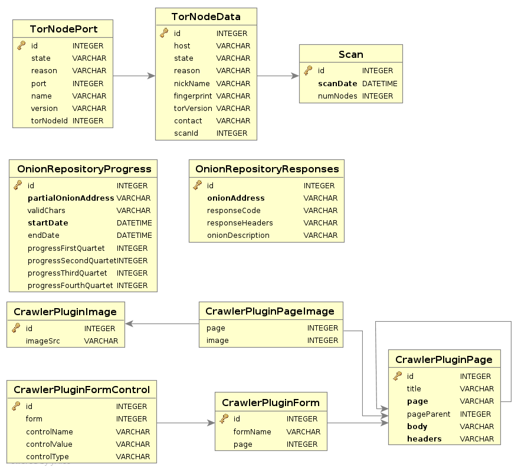

.. _database-mode-label:

****************************************************
Database mode in Tortazo
****************************************************
Tortazo uses an internal SQLite database to store the TOR relays scanned with Nmap and hidden services discovered by the onion repository mode. The switch “-D / --use-database” allows to use the database records instead to perform a scan. This switch is very useful to use with some plugins which requires targets to attack or enumerate.

The core tables used by Tortazo in the version 1.1 are:

* Scan: Stores the date and number of relays found in every scan performed by Nmap.
* TorNodeData: Stores the information of relays found and the state of every one.
* TorNodePort: Stores the information of port states (closed, filtered or opened).
* OnionRepositoryResponses: Stores the responses from the HTTP connections performed against the hidden services in Onion Repository.
* OnionRepositoryProgress: Stores the progress for the Incremental search in the Onion Repository mode.

On other hand, the Crawler plugin stores the responses directly in the database, using the following structure

* CrawlerPluginPlage: Stores the pages and HTTP responses.
* CrawlerPluginImage: Stores the images found in the crawling process.
* CrawlerPluginPageImage: Stores the relation between the images found and the pages.
* CrawlerPluginForm: Stores the basic information about the forms found in the pages crawled by the plugin.
* CrawlerPluginFormControl: Stores the controls which are included in every form found.

The database schema in this mode is the following.

